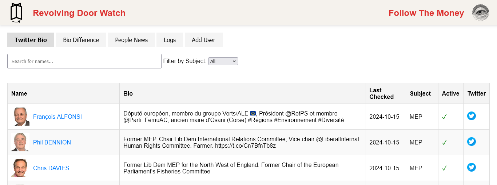
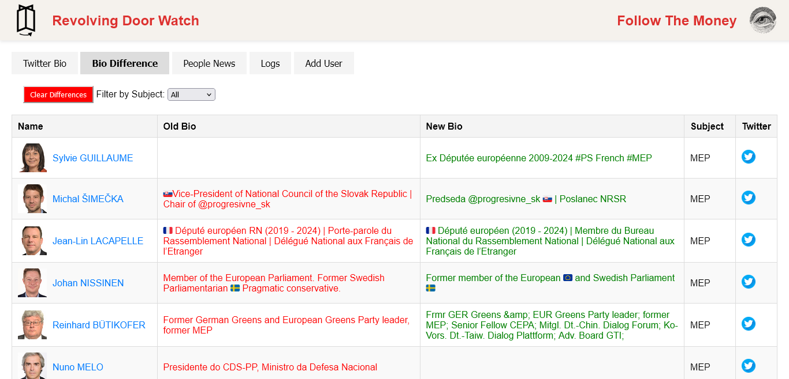
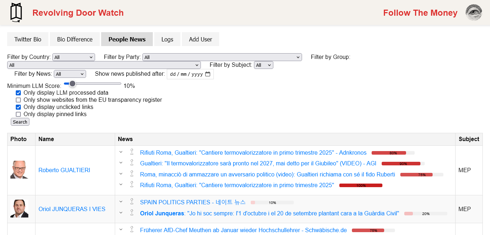
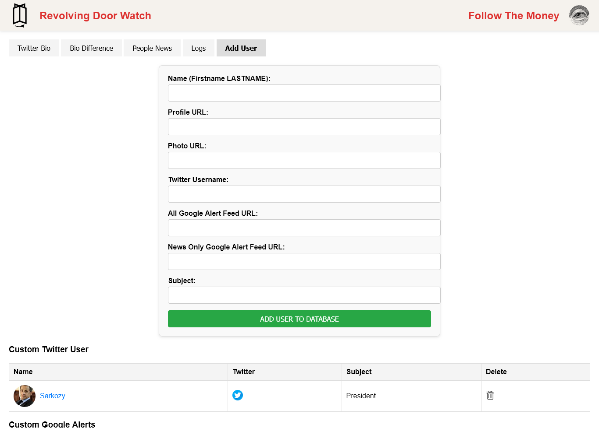

#  Revolving Door Watch
Application tracking MEPs that left the European parliament after the 9th term.

Features :
1. Detecting changes in Twitter bios.
    1. Filter by name
    2. Disable/Enable a profile.
2. Getting news from Google alerts.
    1. Filter by date.
3. Manually add people to the Twitter or Google Alerts watch.

## Login page
Protected login to prevent. Login is shared between users for now.


## Main page
Allows the user to read the twitter bio of all non-reelected MEPs.


## Difference in bio
Highlight difference in bios that could reflect a change of job title.


## News aggregation
Shows all recent news from each MEPs. Allows user to filer by date.


## Add new users
This page allows to add new user to watch over. You need to input the Twitter username or/and Google Alerts RSS url.
You can also delete any custom users added.


## Installation
One docker handles the database (running MongoDB), the other docker runs the code of:
1. The webserver running Flask
2. A Twitter script using [TweeterPy](https://github.com/iSarabjitDhiman/TweeterPy). Checking for changes in twitter bios.
3. A script checking for changes in the RSS feeds of the google alerts linked with MEP's.


All parameters, twitter logins, web UI logins, API keys are stored in a config file. 

### Compose a Docker image
```
docker compose build
```

```
docker compose up
```

### MongoDB Docker and Database
The database is available for direct download, it need to be imported in a [MongoDB](https://www.mongodb.com/docs/manual/tutorial/install-mongodb-community-with-docker/) docker.


```
mkdir database
cd database
curl -L 'https://drive.google.com/uc?export=download&id=1Pp6xUYeom6NvKU4AM9nI33hDPHyLcAlJ' -o backup.zip
unzip backup.zip
cd database2/backup
```
Add the database to the docker
```
docker cp production/ revolvingdoor-master-mongodb-1:/to_import
docker exec revolvingdoor-master-mongodb-1 mongorestore --db production /to_import
```

### Setup the configuration file
Edits fields in config_example.json and rename it config.json

You will need:
1. A twitter account. Don't use your account, you may get banned.
2. A Webshare.io API key to get a proxy.
3. You need to generate a [Flask Secret Key](https://whiztal.io/secret-key-generation-for-django-and-flask/).

Edit the public IP of the machine running the code in the main function of webUI.py.


## TODO
1. Add alerts when name are detected in other datasets ?
